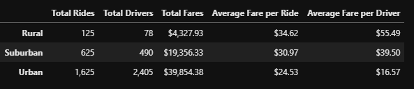
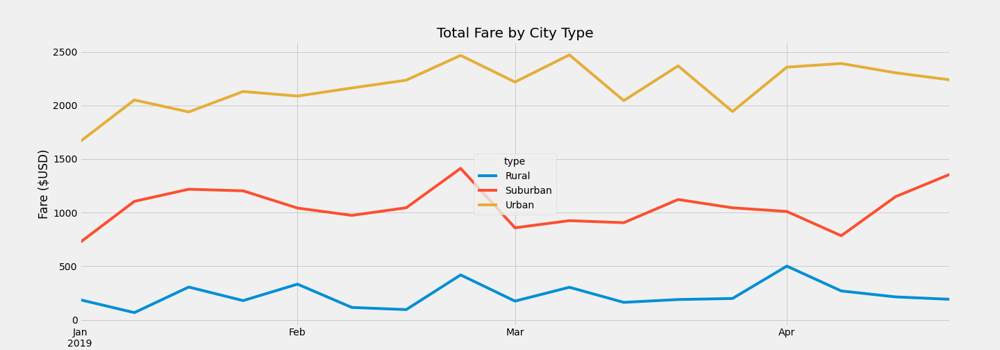

# PyBer Analysis

## Project Overview
The task was to create a summary DataFrame of the ride-sharing data by city type.
Using Pandas and Matplotlib, the goal was to create a multiple-line graph showing
the total weekly fare for each city type. Based on the results, three business
recommendations are to be made addressing and disparities among the different
city types.

## Resources
- Data Source: city_data.csv, ride_date.csv
- Software: Python 3.7.9 64-bit, Jupyter Lab 2.1.5, Atom 1.51

## Results
The results of the differences in ride-sharing data among the different city types
are as follows:

- The **total rides** for each city type were significantly higher in Urban areas which
is to be expected given that there tends to be more people that need to move from
point A to point B. Rural areas had the lowest amount of rides which is also expected
given that there is less people and more people that live outside of cities would have
a greater need for their own transportation.

- The **total drivers** for each city type were also highest in Urban areas and lowest
in Rural areas for similar reasons as the total rides. There is more demand for
drivers in Urban areas due to more people needing rides.

- The **total fares** for each city type also followed the same trend as the total
rides and total drivers. This makes sense given the sheer volumes of rides in the
Urban areas vs. Rural areas.

- The **average fare per ride and driver** were highest in Rural areas and lowest in
Urban areas which also makes logical sense given that the distance traveled per
fare from a Rural location would generally be longer than from an Urban Centre.

The table below shows the numerical values that were explained above:

- The **total fares by city type** shows that Urban areas have the most total fares
and Rural areas have the lowest. You can also see that there is a spike in all
three between February and March. See chart below:

## Summary
After reviewing the analysis it is obvious that the majority of drivers are in the
Urban Centres where the are more total rides as well. It also stands out that the
highest average fare is from Rural areas. I recommended the following:

1. More drivers available in Rural areas in general to boost company presence.
2. Lower fares in Rural areas to make it appealing to use ride share in these areas.
3. More drivers in Suburban areas with lower fares to entice people to use ride-share
to commute to Urban Centres for work or pleasure.

I also believe that there would be room to explore other avenues such as food delivery
to Rural areas from Urban Centres which might make more drivers available in Rural
areas. 
